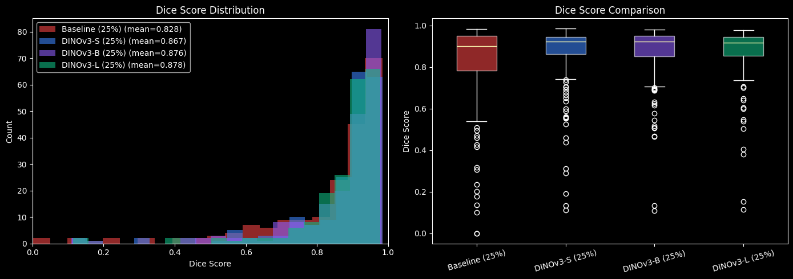
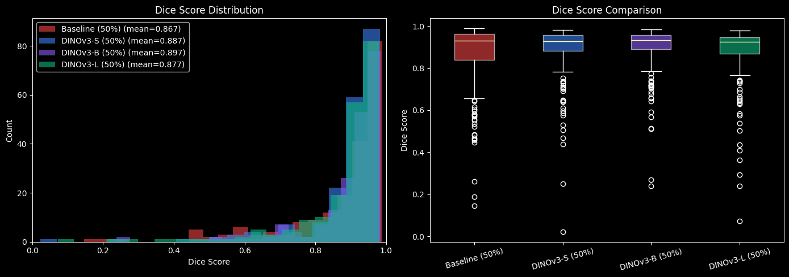
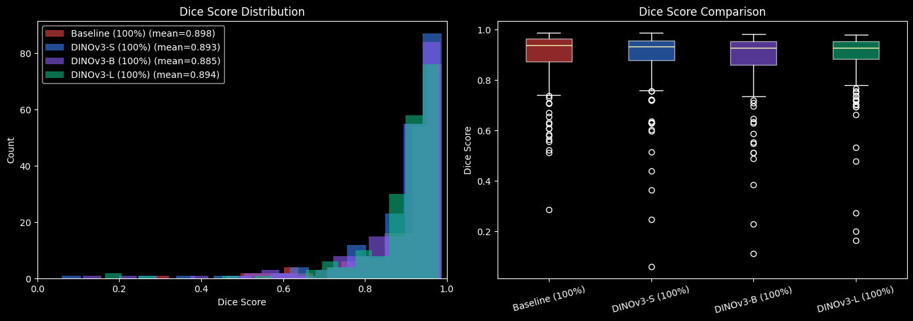
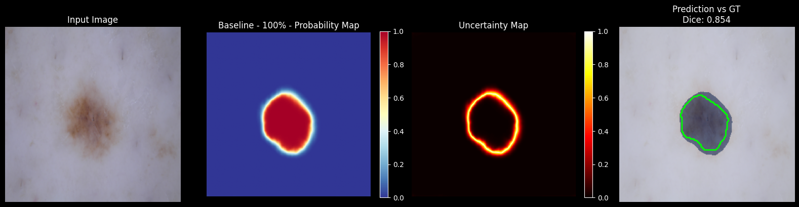
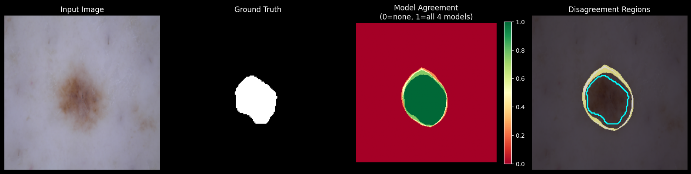

# 🧠 DINOSEG: Self-Supervised Representations for Skin Lesion Segmentatio

**Transfer Learning vs Training from Scratch for Medical Image Segmentation**

[](https://www.python.org/downloads/)
[](https://pytorch.org/)
[](LICENSE)

An empirical study comparing frozen DINOv3 encoders against baseline U-Net for skin lesion segmentation on the ISIC2018 dataset across different data regimes (25%, 50%, 100%).

**Key Finding**: Transfer learning dominates with limited data (+4.8% at 25%), but baseline U-Net surpasses frozen encoders with full data (+1.3% at 100%).

---

## Table of Contents

- [Overview](#overview)
- [Key Results](#key-results)
- [Installation](#installation)
- [Quick Start](#quick-start)
- [Project Structure](#project-structure)
- [Experiments](#experiments)
- [Visualizations](#visualizations)
- [Citation](#citation)
- [License](#license)

---

## Overview

This repository contains the complete implementation and analysis of my Master's thesis comparing transfer learning (frozen DINOv3 encoders) against training from scratch (baseline U-Net) for medical image segmentation.

**Research Questions**:
1. Does transfer learning beat baseline in low-data scenarios?
2. Does baseline catch up with full data?
3. Is larger encoder always better (Small < Base < Large)?

**Dataset**: ISIC2018 Skin Lesion Analysis Challenge (2,594 training images)

**Models Compared**:
- Baseline U-Net (7.76M params, trained from scratch)
- DINOv3-Small + Custom Decoder (25M total, 5M trainable)
- DINOv3-Base + Custom Decoder (90M total, 5M trainable)
- DINOv3-Large + Custom Decoder (156M total, 5M trainable)

---

## Key Results

### Performance Summary

| Model | 25% Data | 50% Data | 100% Data |
|-------|----------|----------|-----------|
| **Baseline U-Net** | 0.828 | 0.867 | **0.898** ⭐ |
| **DINOv3-Small** | 0.867 | 0.887 | 0.893 |
| **DINOv3-Base** | **0.876** | **0.897** | 0.885 |
| **DINOv3-Large** | 0.878 | 0.877 | 0.894 |

### Key Findings

**H1: Transfer Learning Dominates Low-Data Scenarios** ✅
- **+4.8%** advantage at 25% data (650 images)
- **7× more data-efficient** than training from scratch
- **$12-14K saved** in annotation costs

**H2: Baseline Surpasses at Scale** ✅
- Baseline wins at 100% data (+1.3% over DINOv3-Base)
- Complete reversal from low-data regime
- Win rate: 43.5% → 62.5%

**H3: Size Hierarchy Doesn't Hold** ❌
- No consistent Small < Base < Large hierarchy
- DINOv3-Base peaks at 50%, then declines
- Optimal model depends on data regime

### Practical Implications

**< 1000 images**: Use DINOv3 (frozen)
- ROI: 10-20× on annotation costs
- Better robustness on hard cases

**> 2000 images**: Use Baseline U-Net
- Simpler, faster, better performance
- Lower computational requirements

---

## Installation

### Requirements

- Python 3.11+
- PyTorch 2.0+
- CUDA 11.8+ (for GPU training)

### Setup

```bash
# Clone the repository
git clone https://github.com/yourusername/dinov3-isic2018-segmentation.git
cd dinov3-isic2018-segmentation

# Create virtual environment
python -m venv .venv
source .venv/bin/activate  # On Windows: .venv\Scripts\activate

# Install dependencies
pip install -r requirements.txt

# Install package in development mode
pip install -e .
```

### Dataset Preparation

1. Download ISIC2018 dataset from [official source](https://challenge.isic-archive.com/data/)
2. Organize as follows:

```
data/
├── ISIC2018_Task1_Training_Data/
│   ├── ISIC_0000000.jpg
│   ├── ISIC_0000001.jpg
│   └── ...
└── ISIC2018_Task1_Training_GroundTruth/
    ├── ISIC_0000000_segmentation.png
    ├── ISIC_0000001_segmentation.png
    └── ...
```

3. Prepare data splits:

```bash
python scripts/prepare_data.py --data-dir data/ --output-dir data/processed/
```

---

## Quick Start

### Training

**Train Baseline U-Net (100% data)**:
```bash
python scripts/train.py \
    --model baseline \
    --data-fraction 1.0 \
    --epochs 50 \
    --batch-size 8 \
    --lr 3e-4 \
    --output-dir runs/baseline_100_percent
```

**Train DINOv3-Base (50% data)**:
```bash
python scripts/train.py \
    --model dinov3_base \
    --data-fraction 0.5 \
    --epochs 50 \
    --batch-size 8 \
    --lr 3e-4 \
    --output-dir runs/dinov3b_unet_50_percent
```

### Evaluation

```bash
python scripts/evaluate.py \
    --model-path runs/baseline_100_percent/best.pt \
    --data-split test \
    --output-dir results/
```

### Visualization

```bash
python scripts/visualize_samples.py \
    --model-path runs/baseline_100_percent/best.pt \
    --num-samples 10 \
    --output-dir visualizations/
```

---

## Project Structure

```
dinov3-isic2018-segmentation/
│
├── src/dinoseg/              # Main package
│   ├── models/
│   │   ├── baseline_unet.py      # U-Net implementation
│   │   └── dino_v3_unet.py       # DINOv3-UNet architecture
│   ├── training/
│   │   └── trainer.py            # Training loop
│   ├── data/
│   │   └── loader.py             # Data loading utilities
│   └── utils/
│       ├── metrics.py            # Dice, HD95 metrics
│       ├── viz.py                # Visualization utilities
│       └── seed.py               # Reproducibility
│
├── scripts/                  # Executable scripts
│   ├── train.py                  # Training script
│   ├── evaluate.py               # Evaluation script
│   ├── prepare_data.py           # Data preparation
│   └── visualize_samples.py      # Visualization
│
├── assets/                   # Result visualizations
│   ├── full_data/                # 100% data results
│   ├── moderate_data/            # 50% data results
│   └── low_data/                 # 25% data results
│
├── tests/                    # Unit tests
│   ├── test_forward.py           # Model forward pass tests
│   └── test_metrics.py           # Metric calculation tests
│
├── notebooks/                # Analysis notebooks (optional)
│
├── requirements.txt          # Python dependencies
├── pyproject.toml           # Package configuration
├── Makefile                 # Common commands
├── README.md                # This file
└── LICENSE                  # MIT License
```

---

## Experiments

### Data Regimes Tested

- **25%**: ~650 images (low-data scenario)
- **50%**: ~1,300 images (medium-data scenario)
- **100%**: ~2,600 images (full dataset)

### Models Evaluated

All models trained with:
- **Optimizer**: AdamW (lr=3e-4, weight_decay=1e-4)
- **Scheduler**: CosineAnnealingLR
- **Loss**: Binary Cross-Entropy with Logits
- **Batch size**: 8
- **Epochs**: 50 (with early stopping)
- **Augmentations**: nnU-Net standard pipeline

### Metrics

- **Dice Coefficient**: Volumetric overlap (primary metric)
- **Hausdorff Distance 95%**: Boundary accuracy

---

## Visualizations

Sample visualizations from the experiments:

### Distribution Comparison

| 25% Data | 50% Data | 100% Data |
|----------|----------|-----------|
|  |  |  |

### Probability Maps

Examples showing model calibration:



### Model Agreement

Visualization of inter-model consensus:



**More visualizations available in `assets/` directory.**

---

## Reproducing Results

### Full Reproduction Pipeline

```bash
# 1. Prepare data
make prepare-data

# 2. Train all models (warning: takes ~24 hours on H100)
make train-all

# 3. Evaluate all models
make evaluate-all

# 4. Generate visualizations
make visualize-all
```

### Individual Model Training

```bash
# Train specific model at specific data fraction
make train MODEL=baseline FRACTION=1.0
make train MODEL=dinov3_base FRACTION=0.5
make train MODEL=dinov3_small FRACTION=0.25
make train MODEL=dinov3_large FRACTION=1.0
```

---

## Architecture Details

### Baseline U-Net

Standard encoder-decoder architecture:
- **Parameters**: 7.76M (all trainable)
- **Encoder**: 4 levels with MaxPool downsampling
- **Decoder**: Transposed convolution upsampling
- **Skip connections**: Concatenation
- **Trained from scratch** on ISIC2018

### DINOv3-UNet

Hybrid architecture with frozen encoder:
- **Encoder**: Frozen DINOv3 Vision Transformer (pre-trained on LVD-142M)
- **DINO Adapter**: Fuses frozen features with spatial details
- **Shared Context Aggregator**: Extracts global scene understanding
- **FAPM**: Preserves fine-grained details during feature compression
- **Decoder**: Standard U-Net decoder

**Trainable parameters**:
- Small: 4M / 22M (23%)
- Base: 4M / 86M (14%)
- Large: 4M / 304M (6%)

Architecture inspired by [Dino U-Net (Gao et al., 2025)](https://arxiv.org/abs/2508.20909), re-implemented from scratch.

---

## Analysis & Blog Post

Detailed analysis of results available in:
- **Published Article**: [Link to Medium/Blog] (coming soon)

---

## Citation

If you use this code or findings in your research, please cite:

```bibtex
@mastersthesis{diallo2026transfer,
  title={Transfer Learning vs Training from Scratch for Medical Image Segmentation:
         An Empirical Study on ISIC2018},
  author={Diallo, Abdoulaye},
  school={ENSEIRB-MATMECA},
  year={2026},
  type={Master's Thesis},
  note={Signal and Image Processing}
}
```

---

## License

This project is licensed under the MIT License - see [LICENSE](LICENSE) file for details.

---

## Acknowledgments

- **Dataset**: ISIC2018 Skin Lesion Analysis Challenge
- **Foundation Model**: DINOv3 by Meta AI ([Oquab et al., 2023](https://arxiv.org/abs/2304.07193))
- **Architecture Inspiration**: Dino U-Net ([Gao et al., 2025](https://arxiv.org/abs/2508.20909))

---

## Contact

**Abdoulaye Diallo**
ENSEIRB-MATMECA, Signal and Image Processing
Email: [abdoulayediallo338@gmail.com]
[LinkedIn](https://www.linkedin.com/in/abdiallo-ai)
GitHub: [@getrichthroughcode](https://github.com/getrichthroughcode)

---

## Contributing

Contributions are welcome! Please see [CONTRIBUTING.md](CONTRIBUTING.md) for guidelines.

---

## Changelog

### v1.0.0 (January 2026)
- Initial release
- Complete implementation of baseline U-Net and DINOv3-UNet variants
- Experiments on 3 data regimes (25%, 50%, 100%)
- Comprehensive analysis with 96 visualizations
- Technical blog post with findings

---
